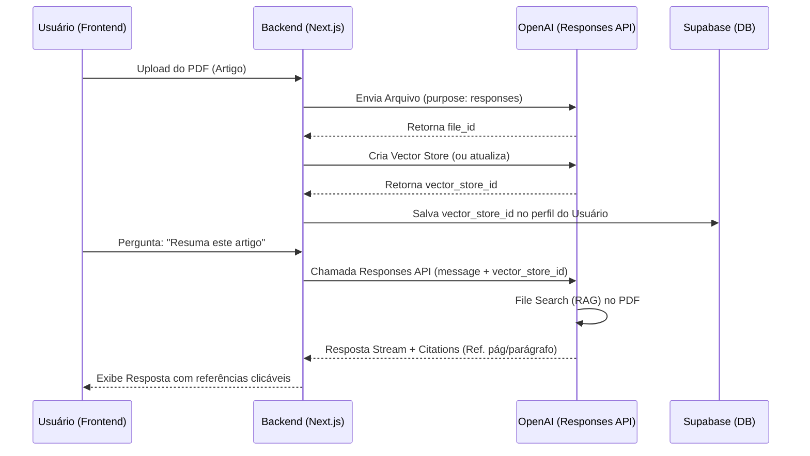

# 📚 Arquitetura: Módulo de Análise de Artigos Científicos (Versão 2026)

Este documento detalha o plano de implementação para o recurso de análise de documentos (PDF/DOCX) utilizando a **OpenAI Responses API**, garantindo que o sistema seja sustentável e utilize o que há de mais moderno em maio de 2026.

---

## 1. Visão Geral
O objetivo é permitir que usuários do **Plano Profissional** façam upload de artigos científicos para que o assistente especializado (ASS-07) realize resumos, extração de dados e análises críticas baseadas no conteúdo real dos arquivos.

## 2. Pilares Tecnológicos (Stack 2026)
*   **API:** OpenAI Responses API (`/v1/responses`).
*   **Storage:** OpenAI Vector Stores (Substitui o antigo Knowledge Retrieval).
*   **Persistência:** Supabase (Armazenamento de `vector_store_id` e `previous_response_id`).

---

## 3. Fluxo de Funcionamento (Diagrama)



---

## 4. Guia para o Gestor (Configuração para o Raphael)

Como o Raphael cuidará da parte administrativa na OpenAI, este guia foi desenhado para ser **não-técnico**:

### Passo 1: Criar o Projeto Dedicado
1. Acesse o [Dashboard da OpenAI](https://platform.openai.com).
2. No menu superior esquerdo, clique no seletor de projetos e escolha **"Create Project"**.
3. Nomeie como: `Jing IA - Analista de Artigos`.
   * *Por que?* Isso isola os custos e os documentos dos usuários profissionais do restante do sistema.

### Passo 2: Gerar a Chave de API (Scoping)
1. Dentro do projeto criado, vá em **Settings > API Keys**.
2. Clique em **"Create new secret key"**.
3. Em **Permissions**, não use "All". Escolha **"Restricted"** e marque apenas:
   * `Models: Read/Write` (Para usar o GPT-5.5)
   * `Files: Write` (Para permitir o upload de artigos)
   * `Vector Stores: Write` (Para criar as bibliotecas de documentos)
4. Copie a chave e envie de forma segura para o desenvolvedor.

### Passo 3: Definir Limites de Custos
1. Vá em **Settings > Usage**.
2. Defina um **Monthly Budget** (Ex: $100) para este projeto específico.
3. Monitore em **Storage** o espaço ocupado pelos PDFs enviados.

---

## 5. Fluxo de Implementação (Técnico)

### Passo 1: API de Upload e Vetorização
Criaremos uma rota para receber o arquivo, enviá-lo à OpenAI e vinculá-lo a um **Vector Store**.

**Preview: `src/app/api/files/upload/route.ts`**
```typescript
export async function POST(req: Request) {
  const formData = await req.formData();
  const file = formData.get('file') as File;

  // 1. Upload do arquivo para a OpenAI
  const openaiFile = await openai.files.create({
    file: file,
    purpose: 'responses', // Novo propósito em 2026
  });

  // 2. Criar ou Atualizar Vector Store do Usuário
  const vectorStore = await openai.beta.vectorStores.create({
    name: `Store_${userId}`,
    file_ids: [openaiFile.id]
  });

  return NextResponse.json({ vectorStoreId: vectorStore.id });
}
```

### Passo 2: Nova Rota de Chat (Responses API)
Diferente da API de Assistants, a Responses API é stateless por padrão, mas usa `store: true` para gerenciar contexto.

**Preview: `src/app/api/chat/responses/route.ts`**
```typescript
export async function POST(req: Request) {
  const { message, vectorStoreId, previousResponseId } = await req.json();

  const response = await openai.responses.create({
    model: "gpt-5.5",
    store: true,
    previous_response_id: previousResponseId, // Mantém a conversa
    input: [{ role: "user", content: message }],
    tools: [{ 
      type: "file_search", 
      vector_store_ids: [vectorStoreId] 
    }],
    response_format: { type: "json_schema", ... } // Respostas estruturadas
  });

  return new Response(response.toReadableStream());
}
```

### Passo 3: Interface de Upload (Frontend)
Um componente visual para anexar arquivos e mostrar o status do processamento.

**Preview: `src/components/chat/FileUpload.tsx`**
```tsx
export function FileUpload({ onUploadComplete }) {
  const handleFileChange = async (e) => {
    const file = e.target.files[0];
    const formData = new FormData();
    formData.append('file', file);
    
    const res = await fetch('/api/files/upload', { method: 'POST', body: formData });
    const { vectorStoreId } = await res.json();
    onUploadComplete(vectorStoreId);
  };

  return (
    <button onClick={() => inputRef.current.click()}>
      <PaperclipIcon />
      <input type="file" hidden ref={inputRef} onChange={handleFileChange} />
    </button>
  );
}
```

---

## 4. Considerações de Sustentabilidade (User Global Rules)

1.  **Generalização:** A rota de upload será genérica. Se amanhã o "Social Media" também precisar ler PDFs, a infraestrutura já estará pronta.
2.  **Qualidade vs Gambiarra:** Não vamos "ler o PDF e mandar o texto no prompt". Vamos usar o **File Search nativo**, que é mais barato, rápido e permite que a IA cite a página exata do artigo (Citations).
3.  **Segurança:** A rota de upload terá verificação de plano. Apenas `plan_id === 'profissional'` terá acesso ao recurso.

---

## 5. Próximos Passos
1.  **Instalação de Dependências:** Verificar se a SDK da OpenAI está na versão mais recente (v6.x+).
2.  **Configuração de Limites:** Definir o tamanho máximo de arquivo (Sugerido: 20MB).
3.  **Implementação do Backend:** Iniciar pela rota de upload e teste de vetorização.
