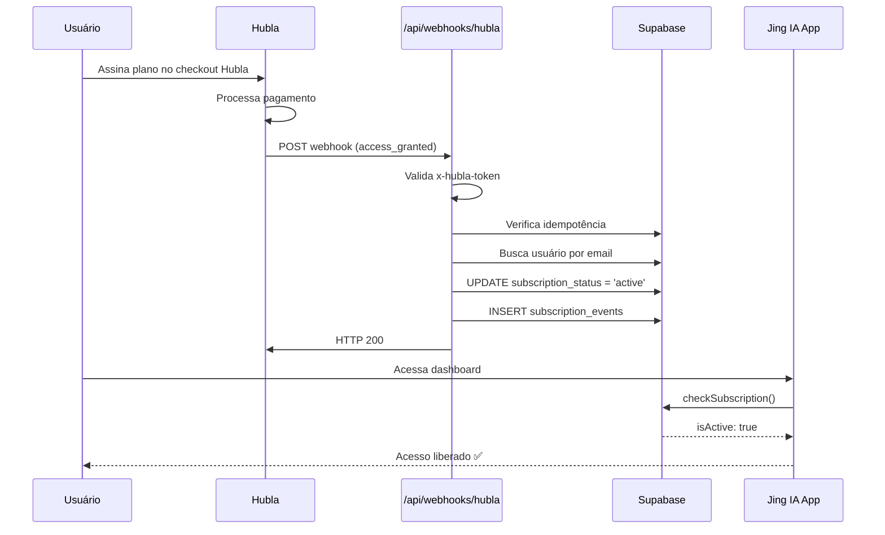

# Integração Jing IA ↔ Hubla Webhooks

## Contexto

O Jing IA precisa receber notificações da Hubla em tempo real para gerenciar o ciclo de vida das assinaturas dos acupunturistas. Atualmente o projeto tem:

- ✅ Clerk webhook funcional (sincroniza `user.created`/`user.updated`)
- ✅ Schema de banco `users` com campos `subscription_status`, `plan_id`, `subscription_expires_at`
- ✅ Lógica de verificação de assinatura ativa em `subscription.ts`
- ✅ Estrutura de plans em `plans.ts` (Essencial/Profissional)
- ❌ **Nenhum** webhook de pagamento implementado (apenas placeholder em `.env.local`)
- ❌ **Nenhuma** tabela `subscription_events` criada no Supabase
- ❌ **Nenhuma** rota `/api/webhooks/hubla` implementada

---

## User Review Required

> [!IMPORTANT]
> **Vinculação Hubla ↔ Clerk:** A Hubla identifica o comprador pelo **e-mail**. O vínculo com o usuário no nosso sistema será feito por `email` (campo único na tabela `users`). Se o usuário da Hubla usar um e-mail diferente do cadastro no Clerk, o sistema não conseguirá vincular automaticamente. **Recomendação:** na página de planos/checkout, orientar que o e-mail de compra na Hubla deve ser o mesmo do cadastro na plataforma.

> [!WARNING]
> **Produtos na Hubla:** Você precisará criar os 2 produtos na Hubla correspondentes aos planos:
> - **Plano Essencial** (R$ 29,90/mês) → será identificado por um `productId` da Hubla
> - **Plano Profissional** (R$ 79,90/mês) → será identificado por outro `productId`
>
> Esses IDs serão mapeados para os `plan_id` internos (`essencial` / `profissional`). Precisarei dos IDs dos produtos quando você criá-los.

> [!CAUTION]
> **Segurança:** A Hubla usa `x-hubla-token` (token estático por configuração de webhook) para autenticação — diferente do HMAC-SHA256 mencionado no documento técnico original. O plano está ajustado para essa realidade. Não existe HMAC na Hubla, a validação é por comparação direta do token.

---

## Proposed Changes

A implementação está dividida em 6 fases sequenciais, cada uma validável isoladamente.

---

### Fase 1 — Configuração na Plataforma Hubla

**Ações manuais no painel da Hubla:**

1. Acessar **Integrações → Webhooks → Ativar Integração**
2. Copiar o **token** gerado (será nosso `HUBLA_WEBHOOK_TOKEN`)
3. Criar uma **regra de webhook** com:
   - **Nome:** `Jing IA - Produção`
   - **URL:** `https://SEU_DOMINIO/api/webhooks/hubla`
   - **Produtos:** Selecionar os produtos Essencial e Profissional
   - **Eventos (v2.0.0):**

| Categoria | Eventos | Finalidade |
|-----------|---------|------------|
| **Assinatura** | `subscription_created`, `subscription_activated`, `subscription_deactivated`, `subscription_expiring`, `renewal_disabled`, `renewal_enabled` | Ciclo de vida completo da assinatura |
| **Fatura** | `invoice_created`, `invoice_status_updated`, `invoice_payment_succeeded`, `invoice_payment_failed` | Controle de pagamentos |
| **Membro** | `access_granted`, `access_removed` | Controle de acesso (evento principal) |
| **Reembolso** | `refund_requested` | Revogação imediata |

> [!NOTE]
> Os eventos **`access_granted`** e **`access_removed`** são os mais confiáveis para liberar/revogar acesso, pois a Hubla os dispara de forma consolidada após confirmar pagamento e só quando o status de fato muda.

---

### Fase 2 — Variáveis de Ambiente e Mapeamento de Produtos

#### [MODIFY] [.env.local](file:///c:/Users/gusta/Downloads/jingia/.env.local)

Substituir o `PAYMENT_WEBHOOK_SECRET=placeholder` por:

```diff
-PAYMENT_WEBHOOK_SECRET=placeholder
+# ── Hubla (Webhooks) ─────────────────────────────────────────────────────
+HUBLA_WEBHOOK_TOKEN=token_gerado_pela_hubla_aqui
+HUBLA_PRODUCT_ESSENCIAL=product_id_do_plano_essencial
+HUBLA_PRODUCT_PROFISSIONAL=product_id_do_plano_profissional
```

#### [NEW] [hubla.ts](file:///c:/Users/gusta/Downloads/jingia/src/lib/hubla.ts)

Módulo centralizado de mapeamento Hubla → sistema interno:

```typescript
// Mapeia productId da Hubla para plan_id interno
export function getInternalPlanId(productId: string): string | null {
  const map: Record<string, string> = {
    [process.env.HUBLA_PRODUCT_ESSENCIAL!]: 'essencial',
    [process.env.HUBLA_PRODUCT_PROFISSIONAL!]: 'profissional',
  }
  return map[productId] ?? null
}

// Tipagens dos payloads da Hubla (resumidas)
export interface HublaSubscriptionPayload {
  subscription: {
    id: string
    sellerId: string
    payerId: string
    status: 'active' | 'inactive' | 'expired'
    type: string
    billingCycleMonths: number
    paymentMethod: string
    autoRenew: boolean
    freeTrial: boolean
    modifiedAt: string
    createdAt: string
    lastInvoice?: { ... }
  }
  product?: { id: string; name: string }
  user?: { id: string; email: string; firstName: string; lastName: string }
}
```

---

### Fase 3 — Tabela de Auditoria no Supabase

#### [NEW] Migração SQL: `subscription_events`

Criar tabela conforme o documento técnico (seção 8.3) — **já prevista mas nunca criada:**

```sql
CREATE TABLE IF NOT EXISTS subscription_events (
  id             UUID DEFAULT gen_random_uuid() PRIMARY KEY,
  user_id        UUID REFERENCES users(id),
  event_type     VARCHAR(100) NOT NULL,
  event_id       VARCHAR(255) UNIQUE,  -- ID de idempotência (x-hubla-idempotency ou subscription.id + event_type)
  platform       VARCHAR(50) NOT NULL DEFAULT 'hubla',
  payload        JSONB NOT NULL,
  processed_at   TIMESTAMPTZ DEFAULT NOW(),
  status         VARCHAR(20) NOT NULL,  -- 'success', 'failed', 'ignored'
  error_message  TEXT
);

CREATE INDEX idx_subscription_events_event_id ON subscription_events(event_id);
CREATE INDEX idx_subscription_events_user_id ON subscription_events(user_id);
```

---

### Fase 4 — Endpoint de Webhook

#### [NEW] [route.ts](file:///c:/Users/gusta/Downloads/jingia/src/app/api/webhooks/hubla/route.ts)

Endpoint que recebe POST da Hubla. Responsabilidades:

```
Fluxo:
1. Validar x-hubla-token (rejeita 401 se inválido)
2. Verificar x-hubla-sandbox (ignora em produção)
3. Parsear body JSON
4. Extrair event type do payload
5. Verificar idempotência (subscription_events com event_id)
6. Localizar usuário por email
7. Processar evento (switch por tipo)
8. Registrar na tabela subscription_events
9. Retornar 200 imediatamente
```

**Mapeamento de eventos → ações:**

| Evento Hubla | Ação no Banco | subscription_status | Observação |
|---|---|---|---|
| `access_granted` | Ativar assinatura | `'active'` | Libera acesso, define `plan_id` e `subscription_expires_at` |
| `access_removed` | Revogar acesso | `'inactive'` | Remove acesso imediatamente |
| `subscription_activated` | Ativar assinatura (redundância) | `'active'` | Fallback se `access_granted` falhar |
| `subscription_deactivated` | Cancelar assinatura | `'canceled'` | Acesso mantido até `subscription_expires_at` |
| `subscription_expiring` | Notificar | - | Log apenas, pode ser usado para e-mail futuro |
| `renewal_disabled` | Marcar cancelamento futuro | `'canceled'` | Manter acesso até expiração |
| `renewal_enabled` | Reativar renovação | `'active'` | Restaurar status se ainda dentro do período |
| `invoice_payment_succeeded` | Renovar acesso | `'active'` | Atualiza `subscription_expires_at` |
| `invoice_payment_failed` | Log de alerta | - | Não revoga imediatamente (Hubla retenta) |
| `refund_requested` | Revogar imediatamente | `'inactive'` | Conforme RN-06 do documento técnico |

---

### Fase 5 — Métodos de Banco (db.ts)

#### [MODIFY] [db.ts](file:///c:/Users/gusta/Downloads/jingia/src/lib/db.ts)

Adicionar novos métodos ao objeto `db`:

```typescript
// Atualiza status de assinatura do usuário
updateSubscription: async (email: string, data: {
  subscription_status: string
  plan_id?: string | null
  subscription_expires_at?: string | null
}) => { ... }

// Registra evento de webhook na tabela de auditoria
logSubscriptionEvent: async (data: {
  userId?: string
  eventType: string
  eventId: string
  payload: object
  status: 'success' | 'failed' | 'ignored'
  errorMessage?: string
}) => { ... }

// Verifica se um evento já foi processado (idempotência)
isEventProcessed: async (eventId: string): Promise<boolean> => { ... }
```

---

### Fase 6 — Testes e Validação

#### 6.1 Sandbox da Hubla

A Hubla oferece **ambiente de testes (sandbox)** que dispara eventos com o header `x-hubla-sandbox: true`. O plano é:

1. Configurar URL de webhook apontando para o endpoint em dev (via ngrok/cloudflare tunnel)
2. Usar o sandbox da Hubla para disparar cada tipo de evento
3. Verificar no banco que:
   - Evento registrado em `subscription_events`
   - Status de `users` atualizado corretamente
   - Idempotência funcionando (enviar mesmo evento 2x)

#### 6.2 Cenários Críticos

| Cenário | Resultado Esperado |
|---|---|
| Pagamento aprovado (access_granted) | `subscription_status = 'active'`, `plan_id` correto |
| Cancelamento (access_removed) | `subscription_status = 'inactive'` |
| Reembolso (refund_requested) | `subscription_status = 'inactive'` imediatamente |
| Evento duplicado | Segundo evento ignorado (HTTP 200, status `'ignored'`) |
| E-mail não encontrado | Log warning, evento registrado com `user_id = null`, status `'failed'` |
| Token inválido | HTTP 401, sem processamento |
| Evento de sandbox em produção | Ignorado, retorna 200 |

---

## Arquitetura do Fluxo Completo



---

## Edge Cases e Proteções

### 1. Eventos Fora de Ordem
A Hubla **não garante ordem cronológica**. Solução: usar o campo `version` (quando disponível) ou `modifiedAt` do payload para aceitar apenas atualizações mais recentes que o estado atual.

### 2. Race Conditions
Se dois eventos chegam simultaneamente, usar a coluna `event_id` com constraint `UNIQUE` garante que apenas o primeiro será processado.

### 3. Usuário compra antes de criar conta
Se o e-mail do pagamento não existe na tabela `users`:
- Registrar evento com `user_id = null` e `status = 'failed'`
- Quando o usuário criar conta via Clerk (mesmo e-mail), um cron/check pode reprocessar eventos pendentes **OU** o `access_granted` subsequente fará a vinculação

### 4. Mudança de Plano (Upgrade/Downgrade)
Quando o usuário muda de Essencial para Profissional:
- A Hubla dispara `access_removed` + `access_granted` com novo `productId`
- O mapeamento `HUBLA_PRODUCT_*` garante que o `plan_id` correto seja atribuído

---

## Resumo de Arquivos

| Ação | Arquivo | Descrição |
|------|---------|-----------|
| MODIFY | `.env.local` | Adicionar `HUBLA_WEBHOOK_TOKEN` e `HUBLA_PRODUCT_*` |
| NEW | `src/lib/hubla.ts` | Tipos e mapeamento de produtos Hubla |
| NEW | `src/app/api/webhooks/hubla/route.ts` | Endpoint de webhook |
| MODIFY | `src/lib/db.ts` | Métodos `updateSubscription`, `logSubscriptionEvent`, `isEventProcessed` |
| SQL | Supabase Console | Criar tabela `subscription_events` |

---

## Open Questions

> [!IMPORTANT]
> 1. **Produtos na Hubla:** Você já criou os 2 produtos (Essencial e Profissional) na plataforma? Se sim, qual o `productId` de cada um? Preciso desses IDs para configurar o mapeamento.
> 
> 2. **Domínio de produção:** Qual será a URL do webhook? (ex: `https://jingia.com.br/api/webhooks/hubla`). Para testes, usaremos ngrok ou cloudflare tunnel.
> 
> 3. **Checkout:** O checkout será feito diretamente na página da Hubla (link de checkout) ou você quer um botão que redireciona da página de planos do Jing IA para o checkout da Hubla?

---

## Verification Plan

### Testes Automatizados
- Criar test file simulando payloads da Hubla e verificando as ações no banco
- Testar validação de token (aceitar válido, rejeitar inválido)
- Testar idempotência (mesmo evento processado 2x)

### Testes com Sandbox
- Usar ambiente sandbox da Hubla para disparar cada tipo de evento
- Verificar tabela `subscription_events` no Supabase
- Verificar tabela `users` com status atualizado
- Acessar dashboard e confirmar que o acesso foi liberado/revogado

### Validação Manual
- Fluxo completo: criar conta → comprar plano → acessar dashboard → cancelar → perder acesso
