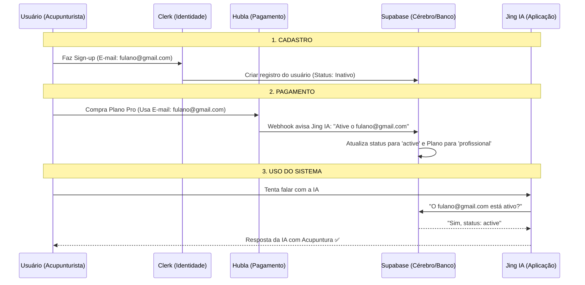

Essa é uma excelente pergunta! Para que o **Jing IA** funcione como uma plataforma "Premium", essas três peças trabalham juntas em uma coreografia automática. O ponto de união entre todas elas é o **E-mail do Usuário**.

Aqui está como o fluxo funciona na prática, do momento em que o acupunturista conhece o site até o momento em que ele começa a usar a IA:

### 1. O Fluxo de Identidade (Clerk ↔ Jing IA)
O **Clerk** é o seu "porteiro". Ele cuida de quem entra e quem sai.
1.  O usuário clica em "Cadastrar-se" no Jing IA.
2.  Ele cria a conta (Google ou E-mail/Senha).
3.  **Webhook do Clerk:** No exato segundo em que ele cria a conta, o Clerk avisa o Jing IA: *"Ei, um novo usuário com o e-mail 'fulano@gmail.com' acabou de entrar"*.
4.  O Jing IA salva esse usuário na tabela `users` do seu banco de dados (Supabase) com o status `inactive` (inativo).

### 2. O Fluxo de Pagamento (Hubla ↔ Jing IA)
A **Hubla** é o seu "caixa". Ela cuida do dinheiro e das permissões de acesso.
1.  O usuário decide assinar o Plano Profissional e vai para o checkout da Hubla.
2.  Ele realiza o pagamento usando o **mesmo e-mail** (`fulano@gmail.com`) que usou no cadastro.
3.  **Webhook da Hubla (o que configuramos agora):** Assim que o pagamento é aprovado, a Hubla avisa o Jing IA: *"O usuário 'fulano@gmail.com' agora é Pro!"*.
4.  O Jing IA recebe esse aviso, procura o e-mail no banco e atualiza o `subscription_status` para `active`.

### 3. O Fluxo de Uso (Jing IA App)
Aqui é onde o sistema decide se libera ou bloqueia o usuário.
1.  O usuário entra no Chat para falar com a IA.
2.  O sistema executa a função que temos no código chamada `checkSubscription`.
3.  Ela olha no banco de dados: *"O status de 'fulano@gmail.com' é 'active'?"*.
4.  **Se sim:** A IA responde.
5.  **Se não:** O sistema mostra aquela tela bonita de "Faça o Upgrade para continuar".

---

### Diagrama do Fluxo Completo

### Por que esse formato é sólido e seguro?
*   **Independência:** Se o Clerk cair, o Hubla continua vendendo. Se a Hubla cair (raro), quem já pagou continua logado.
*   **Segurança:** O usuário não consegue "fingir" que pagou, pois o sistema só acredita no aviso (Webhook) assinado e autenticado que vem direto do servidor da Hubla.
*   **Escalabilidade:** Você pode ter 10 ou 10.000 usuários, o fluxo será o mesmo e totalmente automático, sem você precisar mexer em nada manualmente.

**O segredo do sucesso:** Orientar sempre o usuário a usar o **mesmo e-mail** na compra e no cadastro. Se ele fizer isso, a experiência dele será instantânea e sem fricção!