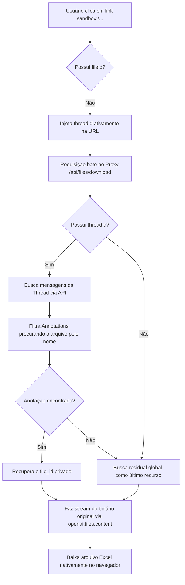

# Relatório Técnico: Arquitetura de Isolamento de Arquivos do OpenAI Code Interpreter e Resolução de Downloads

Este documento fornece um embasamento teórico e arquitetural completo sobre o comportamento de geração, isolamento e resgate de arquivos gerados por assistentes inteligentes utilizando a ferramenta **Code Interpreter** da OpenAI, justificando a necessidade de implementação de um proxy inteligente de download e mapeamento no sistema Jing IA.

---

## 1. Fundamentação Teórica

### 1.1 O Modelo de Isolamento em Sandbox (Virtualização Efêmera)
O **Code Interpreter** da OpenAI executa código Python em um ambiente de sandbox isolado e altamente seguro (conteinerizado). Toda a computação, manipulação e geração de arquivos ocorre de forma estritamente local dentro deste ambiente virtualizado.
- **Localização de Gravação Padrão**: O diretório `/mnt/data/` (ou raízes equivalentes) é montado na sandbox como o local padrão onde os scripts gerados pelo modelo salvam planilhas, gráficos ou imagens.
- **Isolamento de Estado**: O sistema de arquivos da sandbox é efêmero e diretamente acoplado à sessão da **Thread** ativa e ao **Run** em execução. Ele não possui acesso à rede pública externa e não pode expor arquivos diretamente via HTTP/S.

### 1.2 O Protocolo de URI `sandbox://` e a Incompatibilidade do Agente de Usuário (Browser)
Quando o assistente conclui a escrita de um arquivo (por exemplo, um `.xlsx`), ele escreve no texto de resposta um hiperlink utilizando um esquema de URI personalizado próprio do runtime da OpenAI:
```markdown
[Baixar Planilha](sandbox:/Medicina_Tradicional_Chinesa_Fisiologia_Moderna_3.xlsx)
```
- **Problema de Roteamento**: O protocolo `sandbox:` não é registrável nem roteável na pilha de rede padrão da Web. Quando o navegador do usuário tenta resolver uma URL `sandbox:/...`, a requisição falha instantaneamente ou recarrega a página atual por não possuir um manipulador (User Agent Protocol Handler) associado.
- **Omissão de Anotações**: No ciclo ideal da API de Assistentes, a OpenAI anexa metadados chamados **Annotations** (do tipo `file_path`) no bloco da mensagem final. No entanto, por oscilações no streaming da API (Server-Sent Events) ou por gerações ad-hoc do modelo de linguagem (LLM) que ignora o pós-processamento, esses metadados podem vir vazios ou desassociados, fazendo com que o frontend receba apenas o link bruto `sandbox:/...` sem o respectivo identificador `file-xxx`.

---

## 2. A Barreira de Acesso e Escopo da API de Arquivos (`Files API`)

Um dos maiores desafios de arquitetura ao tentar resolver links `sandbox:` sem o `fileId` associado no frontend é estabelecer uma estratégia robusta e sustentável para recuperar o identificador real do arquivo, respeitando os diferentes fluxos operacionais da OpenAI.

### 2.1 Escopo de Recuperação: Identificador Explícito vs. Busca por Nome

O ponto crítico da arquitetura não é apenas a existência física do arquivo gerado, mas a forma correta de recuperar seu identificador real após a execução do Code Interpreter.

Em fluxos baseados na **Assistants API**, os arquivos gerados pelo Code Interpreter são referenciados na mensagem final por meio de anotações do tipo `file_path`. Essas anotações associam o caminho textual exibido ao usuário, como `sandbox:/mnt/data/arquivo.xlsx`, a um identificador interno de arquivo, como `file-xxx`. Esse identificador é o caminho confiável para recuperar o binário por meio da API de arquivos da OpenAI (`openai.files.content`).

Em fluxos baseados na **Responses API**, a arquitetura utiliza containers sandboxed. Nesse caso, os arquivos gerados pelo Code Interpreter aparecem como anotações do tipo `container_file_citation`, contendo `container_id`, `file_id` e `filename`. A recuperação do conteúdo deve ocorrer pelo endpoint de arquivos do container.

Por isso, a aplicação não deve depender de busca global por nome de arquivo como mecanismo principal. Nomes como `relatorio.xlsx` ou `grafico.png` não são identificadores estáveis, podem se repetir entre execuções e podem não representar diretamente o recurso recuperável pela API. A estratégia robusta é preservar ou reconstruir o vínculo entre o link textual `sandbox:/...` e o identificador real retornado nas anotações da mensagem.

Quando o frontend recebe apenas o link bruto `sandbox:/...`, sem o `file_id` associado, o backend precisa usar o contexto da conversa para reconstruir esse vínculo. No caso da Assistants API, isso é feito consultando o histórico de mensagens da Thread e procurando annotations do tipo `file_path` cujo texto ou nome de arquivo corresponda ao link solicitado. Como último recurso, pode existir uma tentativa residual de busca por nome (via `openai.files.list()`), mas ela deve ser tratada como fallback frágil e comportamento observado de escopo, não como fluxo principal.

> [!IMPORTANT]  
> **Conclusão de Design**: Depender exclusivamente de busca cega por nome no repositório global corporativo é uma fragilidade arquitetural. Se a busca falhar, o servidor responderá com um erro JSON (`400/404/500`) que o navegador acabará baixando incorretamente como um arquivo genérico `download.json`. A amarração contextual com a conversa/thread é mandatória.

---

## 3. Arquitetura da Solução Implementada (Jing IA)

Para sanar a raiz do problema de forma generalista e sustentável, sem ferir as políticas de isolamento de threads da OpenAI e as boas práticas de desenvolvimento de software do ecossistema Next.js, implementamos um sistema de **Duplo Fallback Inteligente baseado em Contexto de Thread**.



### 3.1 Camada 1: Enriquecimento de Contexto no Cliente (Frontend)
No componente [ChatMessage.tsx](file:///c:/Users/gusta/Downloads/jingia/src/components/ChatMessage.tsx), o link `sandbox:/` é capturado nativamente por um interpretador personalizado do Markdown (`CustomLink`). 
- O componente extrai a Thread ativa da URL do navegador (`?thread=resp_xxx` ou `?thread=thread_xxx`).
- Reescreve o hiperlink para o nosso proxy seguro e anexa o parâmetro de contexto da Thread:
  `href = /api/files/download?name=arquivo.xlsx&threadId=thread_xxx`
- Força o atributo `target="_self"` e `download` para evitar aberturas desnecessárias de novas abas.

### 3.2 Camada 2: Rastreamento Baseado em Histórico de Conversa (Backend)
No endpoint de download seguro [route.ts](file:///c:/Users/gusta/Downloads/jingia/src/app/api/files/download/route.ts):
- Quando uma requisição de arquivo sem `fileId` explícito chega, o backend utiliza o `threadId` fornecido.
- Executa a busca das mensagens da Thread via `openai.beta.threads.messages.list(threadId)`.
- Percorre iterativamente o histórico de mensagens e examina as anotações do tipo `file_path`.
- Mapeia o nome do arquivo gerado (`fileName`) ao identificador real privado (`file-xxx`).
- Consome o buffer binário original da OpenAI via `openai.files.content(targetFileId)` e faz streaming direto para o navegador do cliente como um arquivo real e legível.

---

## 4. Referencial Técnico e Verificação na Documentação da OpenAI
Para auditar esse comportamento diretamente na documentação oficial da OpenAI, consulte os seguintes tópicos de referência:
1. **Assistants API - Message Parts & Annotations**: Explica como arquivos de saída do Code Interpreter no fluxo de Assistants retornam como anotações `file_path` acopladas ao identificador `file_path.file_id`.
2. **Responses API - Code Interpreter & Containers**: Detalha o modelo de containers isolados onde arquivos de saída retornam anotações `container_file_citation` vinculando `container_id` e `file_id`.
3. **Files API vs Container Files API**: Documenta a distinção de escopo para download de conteúdos de arquivos nos dois ecossistemas.
