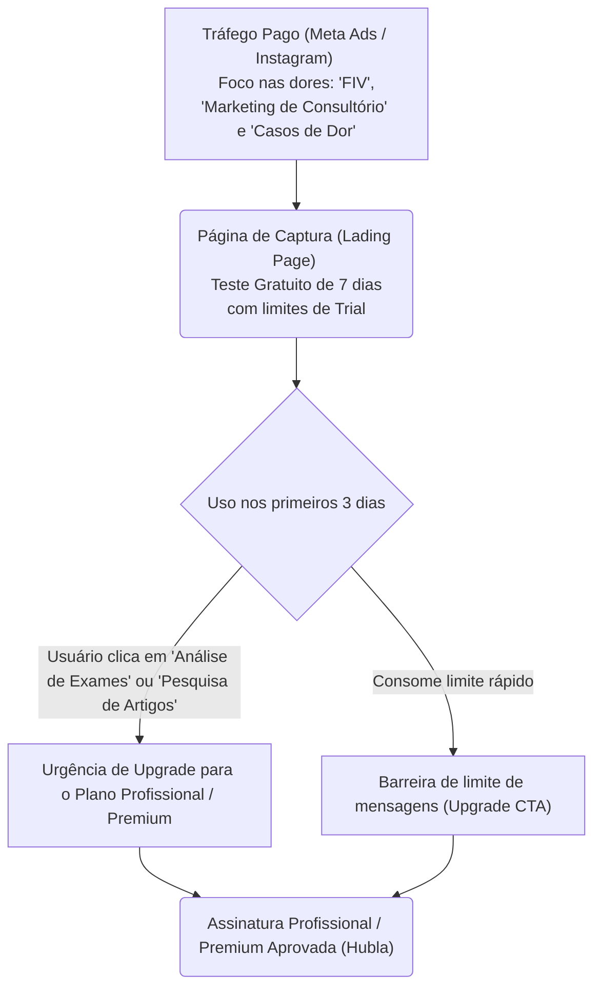

# Plano de Vendas e Publicidade Baseado no Comportamento do Usuário (Jing IA)

Este documento compila uma análise qualitativa e quantitativa dos interesses, dúvidas e comportamentos dos usuários do **Jing IA**, extraída diretamente do processamento de títulos de conversas (threads). Ele fornece o embasamento teórico e direcionamento estratégico necessários para estruturar o plano de vendas, aquisição de clientes (marketing) e publicidade da plataforma.

---

## 1. Mapeamento de Comportamento: O Que os Usuários Buscam?

Análise de agrupamento de **187 conversas** ativas criadas pelos profissionais no sistema.

### 1.1. Distribuição de Temas de Conversa (Necessidades Operacionais)
Os interesses foram categorizados conforme os desafios práticos do profissional no dia a dia do consultório:

| Categoria Temática | Conversas Criadas | Percentual | Job-to-be-Done (O que o usuário quer resolver) |
| :--- | :---: | :---: | :--- |
| **Casos Clínicos e Prescrição** | 105 | 56.1% | Validar raciocínio clínico e obter protocolos de agulhamento para casos complexos em tempo real de consulta. |
| **Teoria, Pontos e Fisiologia** | 22 | 11.8% | Tirar dúvidas rápidas de localização, combinações de pontos (ex: E36, T A5) ou fundamentação teórica da MTC. |
| **Marketing e Gestão Clínica** | 19 | 10.2% | Criar materiais promocionais, posts de Instagram, roteiros de Reels e estruturar captação de parceiros. |
| **Fitoterapia, Florais e Dieta** | 8 | 4.3% | Prescrever formulações fitoterápicas chinesas, florais de Bach e orientar hábitos alimentares terapêuticos. |
| **Exames e Evidência Científica** | 33 | 17.6% | Interpretar exames laboratoriais sob a ótica integrativa ou buscar artigos científicos para atestar eficácia da técnica. |

*   **Raciocínio Clínico Assistido**: Mais de **70%** do uso acumulado da ferramenta (`Casos Clínicos` + `Teoria e Fisiologia`) é focado diretamente no atendimento ao paciente. A IA atua como um co-piloto clínico.
*   **A "Dor" do Marketing de Atração**: Com **10.2%** das interações, a criação de conteúdos de marketing é a segunda maior demanda individual do usuário. O profissional de acupuntura tem dificuldade crônica em produzir conteúdo de atração de leads.

---

### 1.2. Principais Patologias Clínicas Pesquisadas (Foco em Casos)
Quais são os casos reais que chegam nos consultórios dos nossos usuários? Esta frequência de palavras indica os principais motivos de consulta dos pacientes deles:

| Patologia / Condição Clínica | Frequência de Buscas | Exemplos Reais de Termos Pesquisados |
| :--- | :---: | :--- |
| **Dor Crônica e Ortopedia** | 24 | *"Dor lombar crônica"*, *"Lombociatalgia c/ impossibilidade de rotação"*, *"Pinçamento de L5"*, *"Fibromialgia e MTC"*, *"Hernia cervical e lombar"*, *"Melasma misto"*, *"Artrose no joelho"*, *"Lesão de bankart no ombro"*. |
| **Ginecologia, Fertilidade e FIV** | 16 | *"Falhas na TEC (Transferência de Embrião Congelado)"*, *"Paciente tentando engravidar com baixa reserva ovariana"*, *"Borra marrom no início do ciclo"*, *"Menopausa forçada por histerectomia"*, *"Benefícios da acupuntura na indução do parto"*. |
| **Saúde Mental e Emocional** | 7 | *"TDAH em adultos"*, *"Sono de manutenção ruim"*, *"Ansiedade, irritabilidade e frio nas extremidades"*, *"Hipotireoidismo, angústia, sedentarismo e stress"*. |
| **Sistemas Digestivo / Metabólico** | 10 | *"Paciente pós-menopausa com disbiose intestinal"*, *"Síndrome de Guillain-Barré"*, *"Constipação"*, *"Enzima do fígado alterada"*, *"Colesterol alto na MTC"*. |
| **Pediatria e Neonatologia** | 2 | *"Disquesia com auriculoterapia em nenes recem-nascidos"*, *"Pontos de auriculoterapia proibidos em bebês"*. |

---

### 1.3. Demandas de Marketing e Gestão Clinica
O que os usuários pedem para os assistentes de marketing (`ASS-08` e `ASS-09`):

| Canal / Formato de Marketing | Ocorrências | Exemplos Reais Extraídos |
| :--- | :---: | :--- |
| **Instagram Reels / Vídeos** | 3 | *"Texto breve para um reels de no máximo 30 segundos"*, *"Ajustar legenda para um reels"*, *"Reels gravando me apresentando e falando de..."*. |
| **Instagram Stories** | 2 | *"Sequência de stories para o Instagram com o tema..."*. |
| **Parcerias e Captação de Clientes** | 5 | *"Começar a fazer parcerias com médicos e nutricionistas"*, *"Iniciar visitação a médicos e nutricionistas"*, *"Investir em atendimentos para estética para atrair clientes"*, *"Como obter clientes após formado"*. |
| **Fichas e Processo de Atendimento** | 2 | *"Crie uma ficha de anamnese medicina chinesa"*, *"Crie um formulário de anamnese com perguntas para queixa principal"*, *"Monte um questionário segundo as referências..."*. |

---

## 2. Segmentação de ICP (Ideal Customer Profile)

Identificamos a presença de três grandes pessoas (perfis) na base de clientes ativos da Jing IA:

### Persona A: A Acupunturista "Saúde da Mulher & Fertilidade"
*   **Quem é**: Fisioterapeuta, Biomédica ou Farmacêutica especializada em ginecologia e obstetrícia integrativa.
*   **Principal Dor**: Sentir insegurança técnica ao atender tentantes de Fertilização in Vitro (FIV), casos de baixa reserva ovariana, endometriose profunda e menopausa precoce. A complexidade do ciclo menstrual e dos hormônios exige alto rigor.
*   **Job-to-be-Done (JTBD)**: "Garantir que eu prescreva o protocolo de acupuntura e fitoterapia mais seguro e atualizado para não atrapalhar o processo de FIV da minha paciente."
*   **Uso da Jing IA**: Utiliza majoritariamente o `ASS-01`, `ASS-06` (exames de hormônios) e `ASS-07` (pesquisa científica para embasar o protocolo perante o médico da paciente).

### Persona B: O Fisioterapeuta de "Dor Crônica / Traumato-Ortopedia"
*   **Quem é**: Fisioterapeuta de formação que utiliza a acupuntura como recurso analgésico e terapêutico primário.
*   **Principal Dor**: Casos resistentes de lombalgia, cervicalgia e ciatalgia. Pacientes idosos com comorbidades onde técnicas tradicionais não surtiram efeito rápido.
*   **Job-to-be-Done (JTBD)**: "Achar uma combinação de pontos imediatos ou parâmetros de fotobiomodulação (laser/LED) para aliviar a dor aguda do meu paciente na primeira sessão."
*   **Uso da Jing IA**: Utiliza `ASS-01` (casos de dor), `ASS-05` (laser/LED) e `ASS-02` (correlação rápida de meridianos).

### Persona C: O Recém-Formado / Empreendedor de Consultório
*   **Quem é**: Profissional recém-saído da pós-graduação em acupuntura tentando viver de consultório particular.
*   **Principal Dor**: Falta de pacientes, dificuldade de captação de leads, timidez para produzir conteúdo e desconhecimento de como abordar parceiros comerciais (médicos, nutricionistas).
*   **Job-to-be-Done (JTBD)**: "Ter posts prontos, roteiros de Reels interessantes e propostas de parcerias escritas em segundos para que eu possa lotar minha agenda."
*   **Uso da Jing IA**: Utiliza massivamente os assistentes de marketing (`ASS-08` e `ASS-09`), solicitando legendas de Reels, roteiros de atração e fichas de anamnese padrão.

---

## 3. Plano de Publicidade (Marketing de Atração)

Com base no comportamento mapeado, a comunicação publicitária deve abandonar mensagens genéricas ("IA para acupuntura") e focar em **mensagens orientadas a dores específicas** (Segmentação de Criativos).

### 3.1. Copywriting Hooks (Ganchos de Venda) para Tráfego Pago (Meta/Google Ads)

#### Ganho Clínico - Raciocínio em Fertilidade/FIV (Foco Persona A)
*   **Hook 1**: *"Seu paciente de fertilidade te perguntou sobre falhas na Transferência de Embrião Congelado (TEC) e você ficou insegura sobre quais pontos usar? O Jing IA monta o protocolo ideal na hora."*
*   **Hook 2**: *"Tratamento de baixa reserva ovariana na MTC: acesse estudos científicos, interprete exames hormonais e monte o diagnóstico em 1 minuto."*

#### Dor de Atração - Marketing Fácil (Foco Persona C)
*   **Hook 3**: *"Você passa o domingo pensando em posts e Reels para atrair pacientes de acupuntura? O Jing IA escreve roteiros de 30 segundos, legendas e posts prontos voltados para dor crônica, ansiedade e estética. Lote sua agenda sem ser refém das redes sociais."*

#### Eficácia do Alívio da Dor (Foco Persona B)
*   **Hook 4**: *"Acupuntura Neuromuscular e Fotobiomodulação para Dor Aguda: descubra protocolos exatos de agulhamento e dosimetria de laser para lombociatalgia e hérnias difíceis na primeira consulta."*

---

## 4. Plano de Vendas e Funil Comercial

A estratégia de vendas deve capitalizar em cima da segmentação do produto para maximizar o LTV (Lifetime Value) e reduzir a taxa de rejeição de planos.

### 4.1. Estruturação do Funil de Conversão

### 4.2. Táticas para Acelerar Vendas e Conversão

#### 1. Demonstração Interativa ("Casos de Sucesso")
Em vez de explicar como o software funciona, criar criativos em vídeo gravando a tela do Jing IA resolvendo uma queixa complexa em tempo real.
*   *Exemplo*: Digitando *"Paciente mulher, 35 anos, queixa de insônia e dor ciática no meridiano da VB, tomando puran T4. Quais pontos usar?"* e mostrando a resposta estruturada. Isso gera impacto visual imediato (*Aha! Moment*).

#### 2. Parcerias com Escolas e Institutos de Pós-Graduação
A Persona C (recém-formada) busca ativamente por clientes. Fechar parcerias comerciais com cursos de especialização em acupuntura para oferecer 30 dias gratuitos do Jing IA na matrícula do aluno. O aluno aprende a estruturar anamneses clínicas usando a IA e se torna assinante retido após a formação.

#### 3. Upsell Baseado em Uploads (PDFs)
Exames laboratoriais (`ASS-06`) e análise de artigos (`ASS-07`) são recursos altamente valorizados e geram as conversas mais densas.
*   **Tática**: Manter o plano *Essencial* limitado a perguntas de texto simples. Toda vez que um usuário tentar anexar um PDF/exame, acionar um popup de upgrade: *"Interpretação automática de exames laboratoriais e laudos médicos está disponível no plano Premium. Faça o upgrade agora e ofereça medicina integrativa no seu consultório."*

---

## 5. Referencial Teórico Aplicado às Vendas de SaaS Clínico

Para justificar esta abordagem estratégica perante investidores ou seu time de liderança, ancoramos o plano comercial nos seguintes modelos acadêmicos:

1.  **O Modelo de Difusão de Inovações (Everett Rogers)**: Médicos e acupunturistas são profissionais altamente conservadores (tardios na adoção tecnológica) devido à responsabilidade profissional (ética clínica). Para convencê-los, a tecnologia deve apresentar **alta compatibilidade** com o fluxo de trabalho deles (por isso a importância de manter assistentes voltados a fichas de anamnese rápidas) e **baixo risco de experimentação** (período de teste gratuito trial curto com disclaimer médico visível).
2.  **Jobs-to-be-Done (Clayton Christensen)**: O acupunturista não "compra inteligência artificial". Ele compra a **segurança de não errar o diagnóstico do paciente** e a **liberdade de tempo ao não ter que redigir posts de Instagram no final de semana**. Todo o material publicitário deve anunciar o "trabalho concluído" (o post pronto ou o protocolo estruturado), e não a tecnologia utilizada (GPT-4/GPT-4.1).
